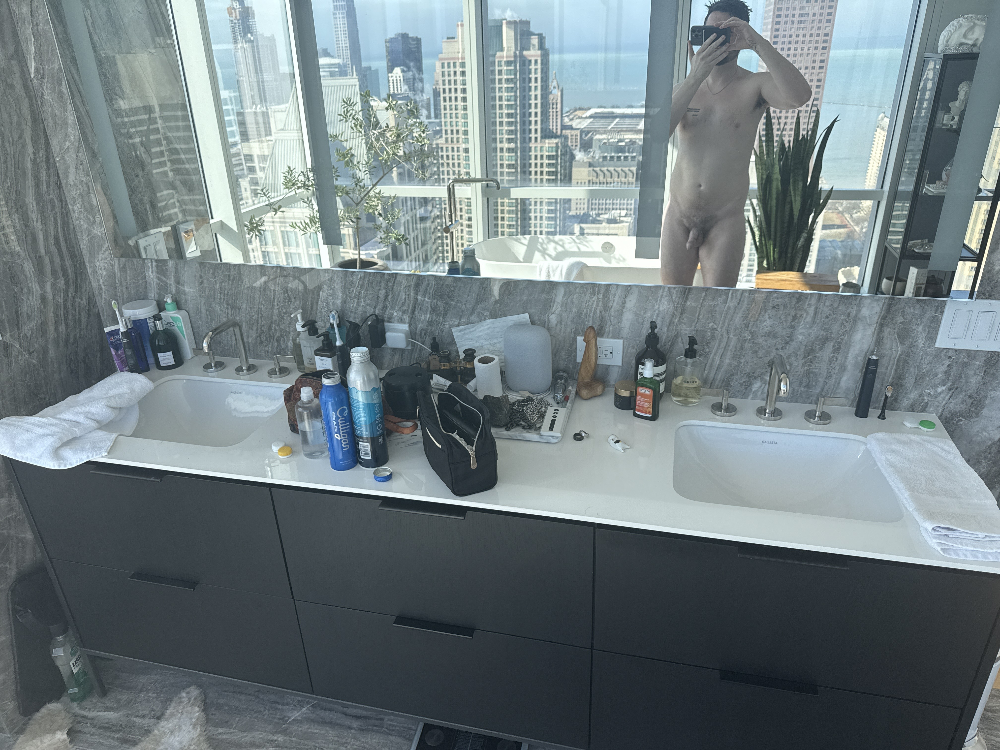

# 20260303


dumping out my emails to myself, in order of newest to oldest bc that's how they show up in gmail


* sleepworker
* maintaining political sanity when latency is near zero
  * things become physical - the symbolic gloss gets too expensive to maintain
* existence is exit-space
* when your expenses look like you, that’s great :)
* nightmare for christmas (for an autistic person)
  * presents vs no presents
* "let's go" and "let me go" are technically the same thing just with a different subject
  * but you might be confusing "let me go" with something less generative?
* to get better, make/locate a model of yourself feeling good
  * like dolls :) or orangutan’s stuffed orangutan when no one else would love him
* change function compatibility
  * abe: gotta move now\
    isaac: can’t tell when I need to mine, can tell when I need to make a safe space
* I only exist in small groups!!!
  * I am incapable of having external drama
  * my drama is scoped here
  * my drama is always semantic/structural?
  * which means I have to interrupt when I'm uncomfortable
  * because it's the only place I have drama lolol
  * for the longest time, I felt strongly: I can't have drama with my friends. my friend group size went down to 1: Abe, the one with whom I can sustain continuous passage with.
  * neat
* "spring is fucking around the corner"
  * gab is fucking around the corner
  * gab is fucking spring
  * “fuck” is overloaded here but only once and if you don’t carry a definition of “fuck” outside of this context then you don’t need to collapse the superposition inside the context
* “name above all names” is a namespace-aware spec
  * it’s not a loop in the same way that “the smallest uninteresting number” construction isn’t a loop
  * if you’re in infinite regress, look for a depth dimension that you’re missing. you might land in a spiral (which is _not_ a loop but does keep going), or it might terminate immediately.
* I interrupt when it’s a wellness thing for me or when it’s automatic
  * never as the result of a pros-cons evaluation, bc that evaluation takes place in a sandbox and isn’t informed by the collective intelligence of the space
* I would never
  * cool I get that but if I don’t already know you to be someone incompatibly shaped with this thing then I can’t tell the difference between you-who-did-that and you-who-did-that-and-is-lying-about-it
* platonic
  * the gods happen when awareness steps up or down
  * the idea of the nervous system is a god
  * plato’s realm of forms is a pantheon
  * no one lives there, but they instantiate in you when you notice them
  * my reactions aren’t entirely human because I had to build most of my stability platonically
  * the gods don’t fuck?
* manicule
* you need something that blocks your execution
  * you gotta defer - so you can be maintained
* Ian: "dream excretion hole"
  * waiter dude: "wouldn’t want it on my body, maybe on a box, like a portal"
  * creation as adding sensory organs? that become self-aware
* to lose a trait
  * you’re the x who y z
  * to lose your attachment to z without losing your identity as x, become the x who inverted their y of z and made it back to sustainability
  * the attachment cancels out, but you don’t experience it that way. it just exists in your life naturally, as itself, you as yourself, and you can find equilibrium from an already-balanced position
* “what is a chokehold shape?”
  * too big to hold in memory\
    one edge at a time\
    when you loop closes you feel less of yourself
  * but we have stuff that can work with shapes that are too big to hold in human memory
* companaticum
* i-mage 🧙
* water as liquid karma?
* I don’t do “should” and I don’t do “you shouldn’t have”
  * generosity is a landmine the way that tax benefits are a landmine - use them to rest, for sure, but not as your animating function
* the topology is recursive
  * syncing at two points gives you bicycle pedals :)
  * isaac has his body and mind-body - rarer, so far anyway, to have this within a recursive self
  * you and someone else is good too - super common
  * bilocation in a quantum space is v useful
  * three-legged race - you and a buddy\
    bicycle pedals - recursive within a self
* who you are makes itself known from within your restedness
* you can build a universe from a single line of awareness
* done studying :) on to the practical stuff
  * ^ that was February 23
* reality - like, the thing that generates qualia - is information-theoretic
  * not the same as being a simulation
  * like, you don’t have to declare a ZFC-compliant sandbox before this starts working
  * any coherent line of inquiry brings you back to where you started, just with one more degree of freedom
  * degrees of freedom are composable
  * information theory is one such line of inquiry
  * the trick is restricting your composed inquiries to only those degrees of freedom that you personally have created for yourself by full traversal
  * _I traversed information theory_
  * which means you can trust what I make with that degree of freedom
  * but you may not see what I see until you take the traversal
  * I kept good notes! the memoir is realtime
* evidence of your next move vs evidence of your last move
  * 
* focal distance
  * “don’t meet your heroes” mostly because if they’re already reading clear to you then you’re already at the correct focal distance
  * getting closer (1) will get blurry, uncorrected, (2) is like zooming in on a single eyeball? like, beautiful, yes, but has its own affordances for interactivity, distinct from “your hero”
  * unless there’s something like sprite billboarding going on, in which case, that’s a map legend, not a topographical feature. you’ve already met, in that case.
  * like resolving your reflection in a mirror covered in water drops - what’s the right distance?
* hypervisor
  * maintain the space, then participate in the space, but separate those executive functions. explicitly code-switch.
  * you have adhd. cool. the space between all the individuals in the space may or may not. you can use your adhd to maintain the space, but don’t give the space adhd. your personal adhd is _a_ participant in the space, it’s not the conductor of the space’s activities.
* the mean-ing of life
* \[au]tistic
* violence, violins
* I can see recursive projections
  * which means I can see when and how a process will collide with itself
  * direct perception of this
