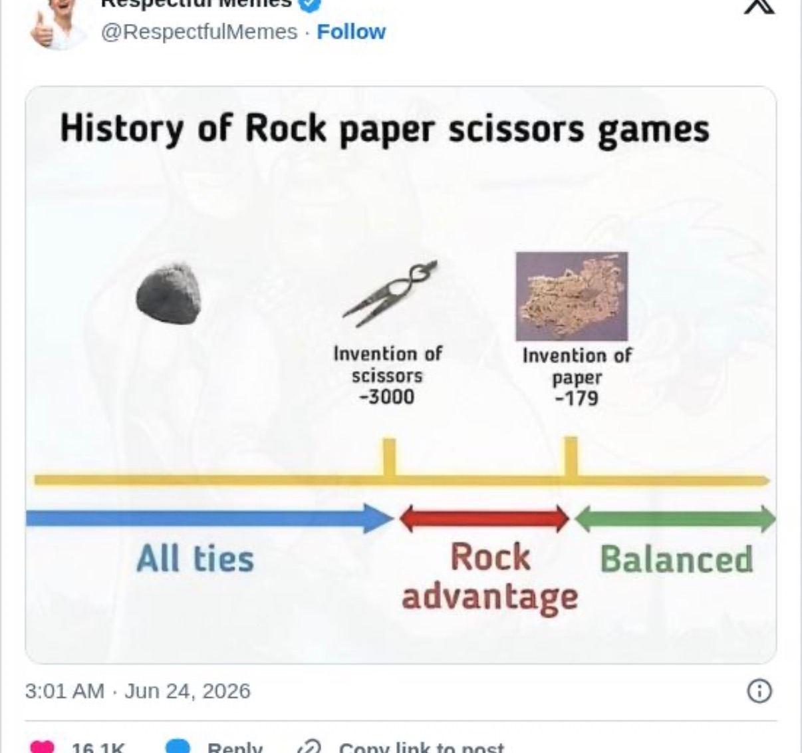
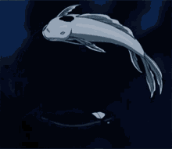

# 20260626

okayyyyy okay okay everyone okay :) okay. okay.

🤲

today I felt the rush of .. a place where more becomes visible/seeable, more and clearer handles for things, and it feels like a place where steady/continuous deflation of scope is the survival mode

from here it feels like Galadriel's passing of the test

***

proceed up to the halfway point, rotate and start over, do that enough times and eventually you'll meet a past-self at the halfway point seamlessly, and the rest of the bridge will be what you built another time from the other direction

the exhausting last mile is totally moot, via this approach, turns into more of a welcome-home thing :)

***

> Love u!! U ok?

intense mind-heart-spirit-math work the last couple days, I get how people slip into egomania when working with world-scale concepts. I’m Galadriel passing the test lol

staying Isaac-sized in my own eyes

> Lolol
>
> Yes
>
> Good job

🫂 feels healthy to be practicing that, I don’t usually have a practice window without you physically next to me

> Ooooo
>
> Good call but don’t practice too much

1000%

safe to rest :)

> For sure

restedness first, then the rest

> Periodttttt

😊

how’s sf?

***

<figure><figcaption></figcaption></figure>

> Incredible

***

a lot of beautiful shapes here :) I have a golden ratio tattoo, on my inner left forearm just down from the wrist, lengthwise, just a black rectangular outline with no fill, my first tattoo, it was my reminder-to-self that deep beauty and deep stability converge and that my aesthetic sense can guide me, nothing to defend. I've approached this territory very very slowly, so as to arrive with pieces that are self-evident

^ something I just jotted down

> Yes!!!!
>
> Love that
>
> U feeling overwhelmed?

mmm I feel like a lot of overwhelmed beings have stood where I’m standing now. I’m not overwhelmed, but I feel the traces of overwhelm in the area

> Gotcha. Take a break from working at all this weekend babe :))
>
> Hang with ur bro and vibe

love my bro 😊 and vibing

thanks bb :)

> Promise me you’ll do that!

okay :)

I’ll take a break ❤️ 😊

ily bb

> It’ll be good for u. And this will be there when u get back

I’m so glad I married you

> :)))

<figure><figcaption></figcaption></figure>

sf foggy

> So cozy!!!!
>
> Home

🥰 🥰 🥰

***

^ something I just jotted down

> I know that tattoo, aye
>
> How does that tie into ✊🫱 ✌️

deep balance :) a balanced game _is_ a convergence of layered aesthetic and layered stabilization

like chess

> 

if the layers are set up, then the gameplay itself is the story of the players arriving at convergence - i.e. arriving at a single point of agreement. a game starts with disagreement (n vectors), ends (typically) with agreement (1 point, motionless)

with the all-important feature that players can return for another game another time, and they get to keep their experience

> The last part is interesting. It all is.
>
> But the last part.

:)))))))))
