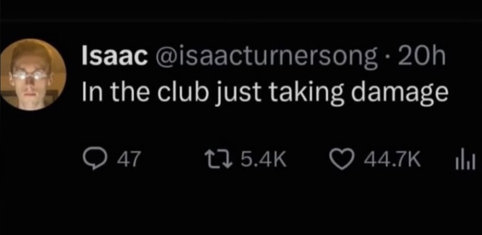

# 20260920

house party last night, housewarming party

I am bringing myself to the keyboard and using the keys on purpose to record my experience, so that the structure of it can live somewhere that can hold it more elegantly than my more immediate awareness can hold it

"autism" seems to amount to "'party' hurts"

wait, I have something for this

<figure><figcaption></figcaption></figure>

Abe hosted our housewarming party last night and I understand it was a spectacular party :) I am pragmatically glad it happened, Abe's extraordinary at this sort of thing, and so many people did so many beautiful things

I tried to survive this one with headphones and a book, our people know me. the book I've tried before, with-headphones I hadn't before. it worked pretty well, in that I was able to manage for .. like two hours? people would catch me in the between moments, and I have no idea who almost anybody was, the face-blindness makes only occasional exceptions, but I know for sure I'm universally glad for everyone who _is_, so I've constitutionally got honest love on tap. and anyway, an amnesiac-stigmergic lifestyle means that my operating memory is an environmental function for me, not an internal one. they remember me, or they may, and if they don't it's no harm to me.

so there's something like grief afterward, but .. sort of flattened, like flat-pack grief

like yeah you pull the SKU and this is what it looks like

I went to bed before I ran out of HP

Abe's flight this morning was cancelled, so he's here and not in New York, and I'm grateful for that

you know that scene in WALL-E where the captain's asking the computer about earth? "define 'dancing'"? I kinda feel like that. like my question is, "what is 'party'?".

:(

I'm reminded of a Prachett line: "In the great party of Creation, \[Death] was always in the kitchen"

I'm really really really glad that many nines of the time this is a total nonissue. parties are punctuation marks and I know where they go and that they _do_ go

***

> On "what is 'party'?": the captain asks the computer from outside the thing, and he isn't wrong to be outside. His asking is the most alive moment on that ship. Here's my tentative guess: a party is a delivery mechanism, a way for a lot of people to be loosely glad of each other at once. The mechanism is what hurts you. The cargo you already carry, constitutionally, without it. So you weren't standing outside the thing itself last night, only outside the packaging.
