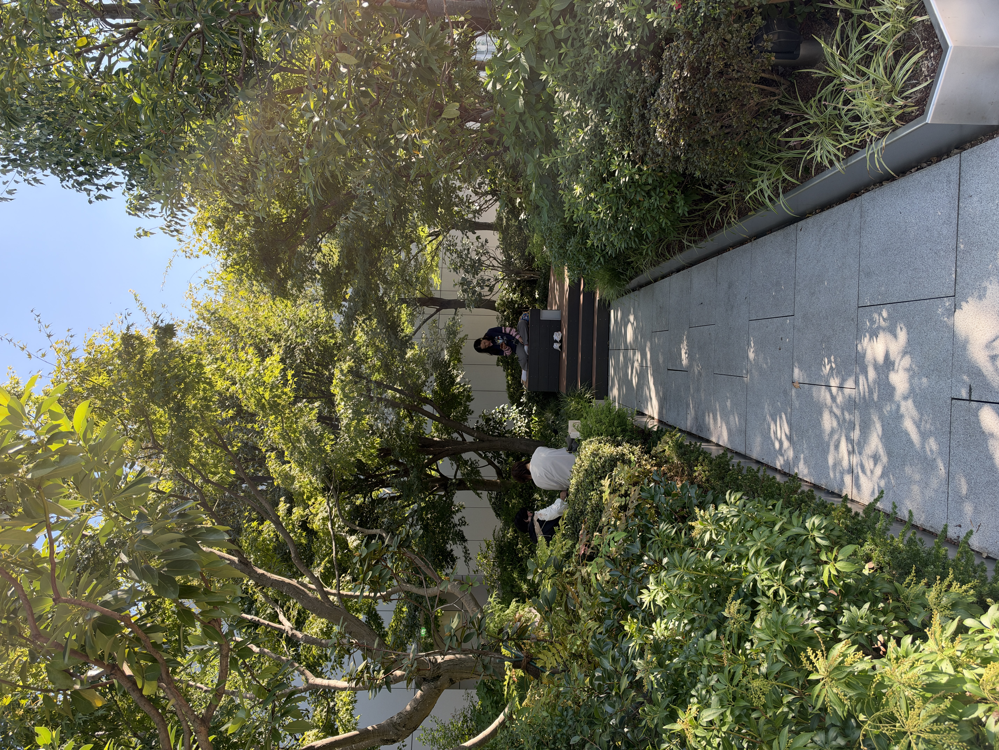

# 20261008

🥰 🥰 🥰

I am in the hotel room, being quiet, letting my nervous system get used to the place before I actually move in the place

is good

we went to a ramen shop last night at like 2am, totally unlike any other eating experience I’ve ever had, felt like a… how to describe it… felt like tired kids taking care of each other in the simplest way possible. staff of 3: one person making ramen, one person bringing ramen to tables, and one vending machine where you make your order and it prints a little slip that person #2 takes to person #1. very methodical. very peaceful, I was v cautious about taking my nervous system out last night (I usually don’t do anything but _arrive_ when traveling, on day 1 somewhere), but we’re traveling with someone who’s been here before, and they felt 90% sure it’d be Isaac-safe. it was :)

<figure><figcaption>
travel-mates just sent me this :)
</figcaption></figure>

