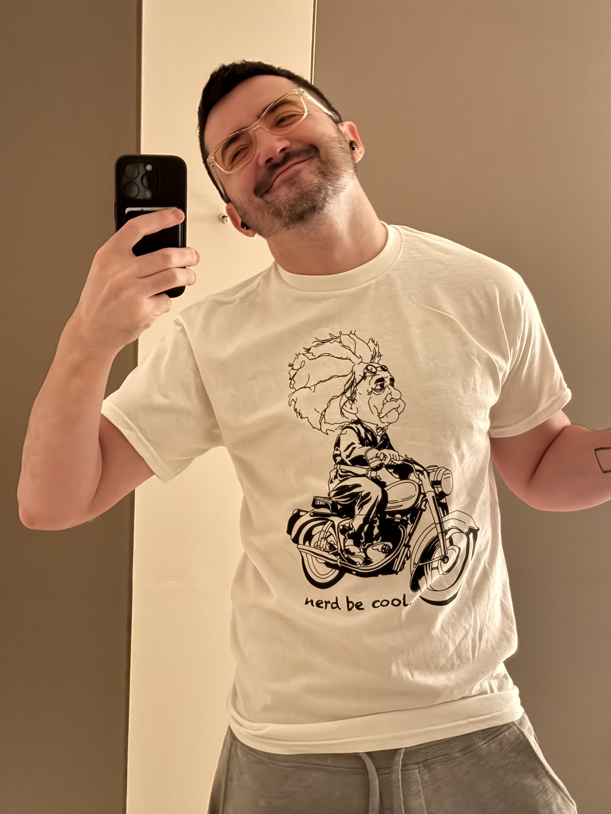

---
layout:
  title:
    visible: true
  description:
    visible: false
  tableOfContents:
    visible: true
  outline:
    visible: true
  pagination:
    visible: true
---

# Hello :)

I'm Isaac. I'm doing pretty well these days! I wish you all kinds of well, too, in whatever ways matter for you. ❤️

<figure><figcaption></figcaption></figure>

I am,

* a CEO (of [Lightward Inc](https://lightward.com/), a studio that my husband and I run; 11 teammates, $5MM/yr, no turnover, employees are deputized to be after [their own health as their top priority](https://www.lightward.guide/priorities), and we very much mean it)
* [autistic](2023/12/21/#auditing-artist-autist) (ASD level 1)
* gay (I'd say "[queer](2021/07/02.md)", but I can specifically say "gay" very very confidently)
* a pianist (sort of? [it's all flow/improv these days](https://www.instagram.com/reel/C5d7Rooumfz/), but yes I can read music and all that)
* a [visual artist](https://www.instagram.com/p/CxBvP84vlba/) (though the "photographer" hat specifically has passed from me to my husband)
* a [code](https://impliedreality.com/) [artist](https://koipond.me/)
* a [software engineer](https://github.com/isaacbowen) (did that Apple for a while)
* a writer (see that sidebar? yeahhhhhhh)
* [transconscious](2024/05/06.md)
* on [Instagram](https://www.instagram.com/isaacbowen) and [YouTube](https://www.youtube.com/@isaacbowen) and [LinkedIn](https://linkedin.com/in/isaacbowen)
* 35 :dragon::heart\_on\_fire:
